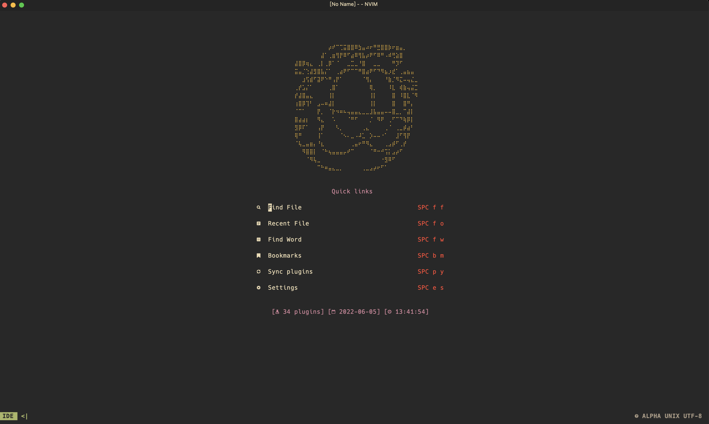
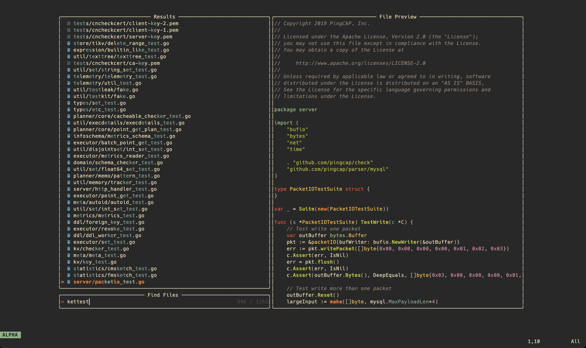
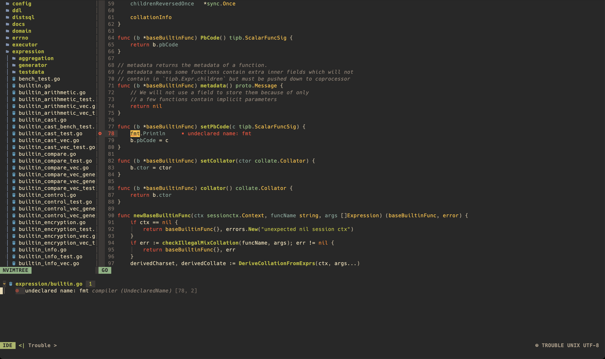
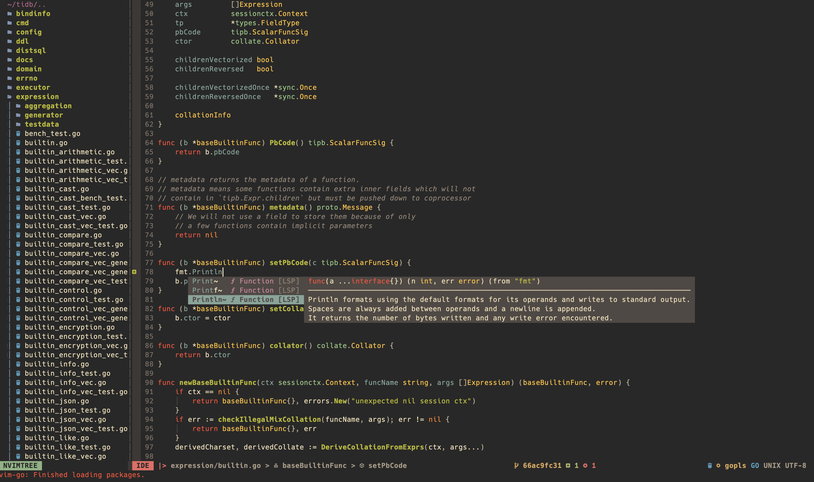

<h1 align="center">nvim-lua.config</h1>

## Showcase

## Requires

1. Make sure you have the release version of Neovim (0.7+).
2. install `ripgrep` and `fzf`

## How to use?

1. Clone code to local dir
2. Copy `/lua` and `init.lua` to `~/.config/nvim/`
3. Open neovim and execute the command line `:PackerSync`

## Plugin List

- File navigation with [nvim-tree.lua](https://github.com/kyazdani42/nvim-tree.lua)
- Beautiful and configurable icons with [nvim-web-devicons](https://github.com/kyazdani42/nvim-web-devicons)
- Pretty and functional statusline with [feline.nvim](https://github.com/Famiu/feline.nvim)
- Git diffs and more with [gitsigns.nvim](https://github.com/lewis6991/gitsigns.nvim)
- NeoVim Lsp configuration with [nvim-lspconfig](https://github.com/neovim/nvim-lspconfig) and [lsp-installer](https://github.com/williamboman/nvim-lsp-installer/)
- Autocompletion with [nvim-cmp](https://github.com/hrsh7th/nvim-cmp)
- File searching, previewing image and text files and more with [telescope.nvim](https://github.com/nvim-telescope/telescope.nvim).
- Syntax highlighting with [nvim-treesitter](https://github.com/nvim-treesitter/nvim-treesitter)
- Autoclosing braces and html tags with [nvim-autopairs](https://github.com/windwp/nvim-autopairs)
- Indentlines with [indent-blankline.nvim](https://github.com/lukas-reineke/indent-blankline.nvim)
- Useful snippets with [friendly snippets](https://github.com/rafamadriz/friendly-snippets) + [LuaSnip](https://github.com/L3MON4D3/LuaSnip).
- Popup mappings keysheet [whichkey.nvim](https://github.com/folke/which-key.nvim)
- This plugin adds Go language support for Vim [vim-go](https://github.com/fatih/vim-go)

